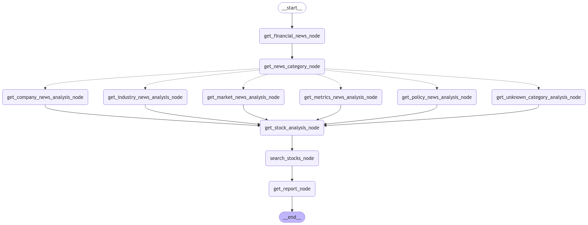

# ai-stock-advisor
[中文版本](README_zh.md)
Stock Analysis Advisor Based on LLM

## Information Analyst
Using the LLM model to analyze the latest news. Analysts will first categorize news into the following categories:
- Company News
- Industry News
- Market News
- Metrics News
- Policy News
- Unknown News
Then, analysts will analyze news from different aspects based on different news categories.
Then, analysts will search for the most relevant stocks from the stock's main profile vector database based on the analysis results, and provide the final report.

### Workflow
